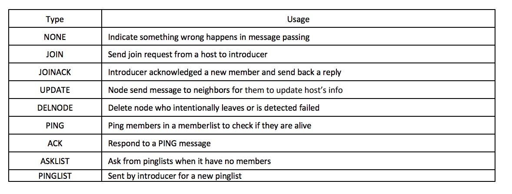

# sdfs: Versioned Simple Distributed File System
## Usage
Use `go build` to compile the code 
The binary will be generated as "sdfs"(Mac OS) or "sdfs.exe". But this program now only support OS X and Linux right now for the file storage functionality.

If running in a single machine:
Firstly need to start the introducer, use `./sdfs -isIntro` to start the introducer, introducer will use port 9123 
Then use `.sdfs -port portNumber` to start a host. 

If running in different machines:
Still start the introducer first, but with command `./sdfs -isIntro -prod` and start all differnt host with `./sdfs -prod`, but every nodes need to know the IP and port number of the introducer, this part needs to be hard coded first.

## Commands:
When the program is running, user can type in different commands to check its status.
1. `id` to show its id(each node have a unique id, it contains its IP address, port number and a timestampe after it started)
2. `membership` to show all the nodes in the system(each node knows this info)
3. `ping` to show the pinglist of a node(pinglist means which node it can ping ) 
4. `intro` to show who is now ther introducer
5. `master` to show the master for the file system
6. `put localname sdfaname` to put a file into SDFS file system
7. `get sdfsname localname` and `get-versions n sdfsname localname` to fetch a file from sdfs system
8. `store` to show which file is now stored in current host(each always file have 4 replicas)
9. `ls sdfsname` to show where a specific file is now being stored
10. `delete sdfsname` to delete a sdfsfile in SDFS file system
11. `showdb` only valid in the file system master, used to show all the files stored in current database and where a specific file is stored
12. `get-versions sdfsname versionnumber ` to get the lastest  versionNumebr of the same filename

## Implementation details
#### distribued membership protol
To implementing a distribued file system, we fistly need a distribute group protocol thus we will be able to know which node is currently in this group, thus we can store file replices in this node. It also make sure that when a failure occurs(simply means a node crashed), nodes in the group can detect this.

I have designed a distributed membership protocol. In this protocol, there are many kinds of message used to maintain the functionality of this group. Like "JOIN" message used for a node to join the group, and "JOINACK" message used for introducer to respond to join request . Like "DELETE" or "UPDATA" used to update the membership, like "Ping" and "ACK" used to check if a node is still alive. They are all defined in package com, in "com.go" file. Below is a simple table used to describe what kind of messages are defined and their usage

For my system, there is a introducer, and other nodes are just hosts who can join the group. Each host is uniquely identified by its port number, IP address and a timestamp, I denoted it as NodeID. And when a node wants to join the group, It will send "Join" message to the introducer, and the introducer will reply with a "JoinACK" message and the pinglist and memberlist for this node. 

The usage of pinglist is for scaling consideration. It is used to constantly check if a node is still alive. For each node, it will send "Ping" message to nodes in its pinglist, if it didn't respond within a given condition, it will deem this node as dead and thus tell other nodes that this node is officially dead. To make this system scalable, every node will not ping every one, they will only ping 4 nodes each time, thus my system can bear less than 4 simultaneous failures.

When a node fails, the introducer will redistribute the pinglist to make sure that every node have 4 nodes to ping. If this is only 4 random nodes, it may be that some nodes have no one to ping. So I make the distribution process round-robin, thus every node will be pinged by some nodes to make sure that failure is always detected.

#### distribuetd file system
In my implementation, there will be a master who stores the meta info of the files in this system. This master is elected using the ring-based election algorithm. And the node with highest id will be elected as the master. When a master is elected, it will tell all the nodes that he is the master. And when any nods detected that the master fails, it will restart and election and elect a new master.

In my distribued file system, each file will have 4 replicas in our system. Now I will give a simple example of how files are storde in my System. When host A  use "put localname sdfsname" to storde a file in SDFS, the node will tell master that it want to store a file by sending "STOREREQUEST" message to the master. The master will select 4 nodes and tell host A to send this file to those four nodes. The master never knows what's stored in this file and it was not necessarily stored in masster. But master will stores meta info of of which stores where files are stored, and how many versions there are for a specific file(Different versions means that a file with same sdfsname is stored in this system for more than once)

Another thing to mention is that I don't store the raw name, sdfsname to the system, I will firstly hash this sdfsname to get a string and attch  a version number at the end of it, for example, the filename `hello_world` may be stored as `13213151312313123|0` the 0 is the version number. The reason why I hash the sdfs name, instead store the it simple the raw name is that some times file name would be `path/file`, but this file name is not valid in Os X and Linux.

When different versions of file are stored, they are simply regarded as different files. because the stored version is `hashed_sdfsanme|0`, and they are not necessarily stored in the same machine. But the file system master will manage where each version of the same sdfs name is stored. 

When we use "get sdfsname", the Host B will send a "GETREQUEST" message to the master, then master will tell host B a node who stores this file, then host B can download this file from this node. GET will defaulty send the newest version of the file back. But we can also use "get-versions" to specify how many versions we want to get back.

If some new node joins, master will check if some files have less than 4 replices, if so, it will tell some hosts to send a file to this new node to reach the state of 4 replices.

If some node files, master will check if some files have less than 4 replices, if so, it will try to send this file to different host to reach 4 replics.

If the master dies, no new files can be stored in this system, and a new election will be raised when a node detected the failure of the master. After the election complete, the new master will use "Askfile" to ask each node what it stored in its file system. And using this info to reconstruct a file meta info database.

## Test
I have tested this program in my own computer, the files are stored in "tmp/sdfs/" directory, and also test this program running in 10 different machines. 
